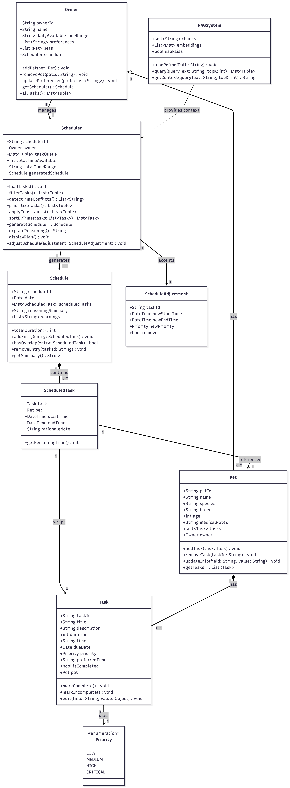
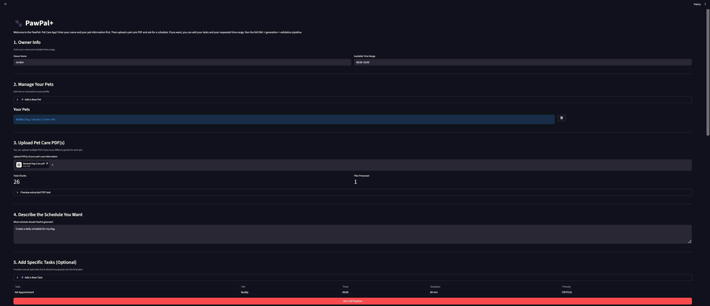
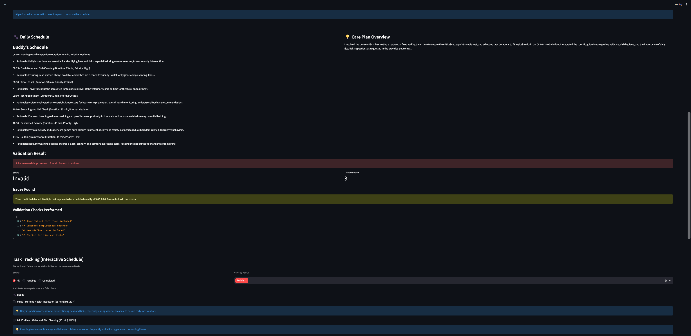
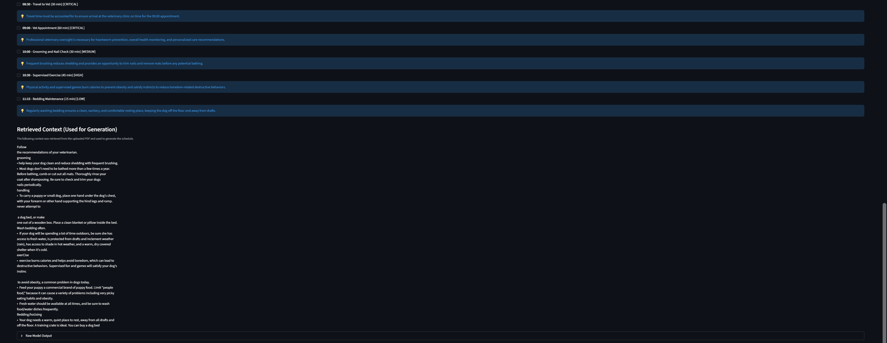
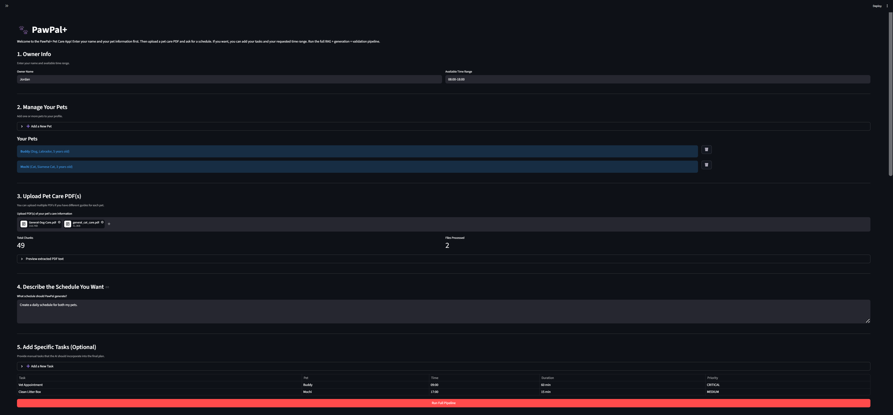
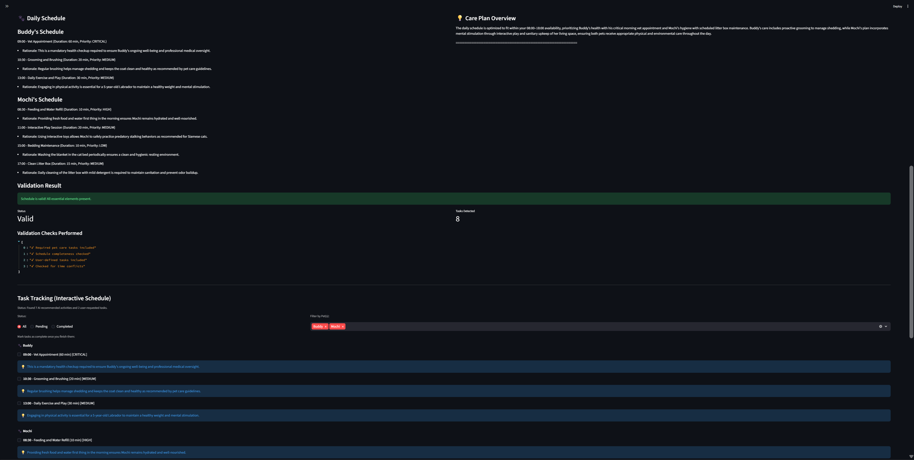
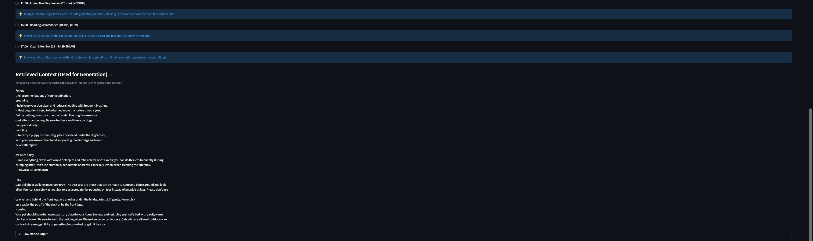
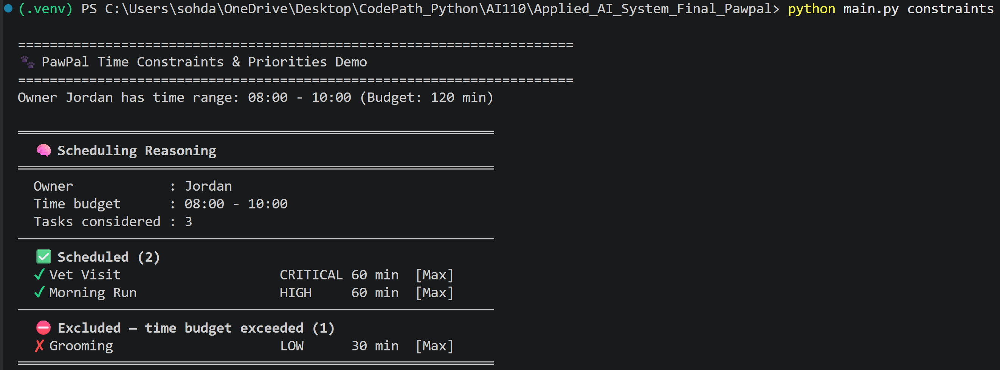

# Pawpal+

- PawPal+ is an AI-powered pet care scheduling system that combines a deterministic scheduling engine with a Retrieval-Augmented Generation (RAG) pipeline to automatically build, validate, and refine daily care plans for one or more pets. It allows owners to define their pets, assign tasks with priorities and time preferences, and have Gemini LLM generate a grounded, natural-language schedule backed by knowledge retrieved from uploaded pet care PDFs. The system also includes a self-correction loop that validates generated schedules against essential care rules — feeding, exercise, and rest — and automatically rewrites them if issues are found, while exposing a Streamlit web interface and a CLI entry point for flexible usage.
- Demo Video Recording Link: https://drive.google.com/file/d/1VIdXEOeQ9NVmd2mYNYdmmyvvqHCdpyyW/view?usp=sharing

---

### Title and Summary

Pawpal+ is an AI-powered daily pet care assistant. It takes an owner's pets, their tasks, and their available time window, and produces a structured, time-stamped daily plan that respects priorities, avoids conflicts, and fits within the owner's schedule. It uses a Gemini LLM grounded in real pet care knowledge from uploaded PDFs to generate natural-language schedules with per-task rationale, then validates and self-corrects them before the owner ever sees the result. The system works in three layers. First, the scheduler loads all incomplete tasks across every pet and schedules them based on priority and user's available time range. Second, the Gemini agent takes that structured context plus retrieved pet care guidelines from the RAG system and produces a human-readable schedule with explanations. Third, there is a validation to check the output for missing essentials — feeding, exercise, rest — time conflicts, and any custom tasks the owner requested, and if anything is wrong, it sends the issues back to the LLM for an automatic rewrite. This design matters because it respects to the owner's real constraints, can handle multiple pets, grounds AI output with real knowledge, catches any mistakes, and bridges AI output and structured data.

---

### Architecture Overview

UML Diagram:


The domain layer (Owner, Pet, Task, Priority) defines the real-world data model — who owns which animals and what care activities need to happen. The scheduling layer (Scheduler, Schedule, ScheduledTask, ScheduleAdjustment) applies purely deterministic logic — prioritization by urgency, time-budget constraints, conflict detection — to turn that data into a concrete, time-stamped daily plan. The AI layer (GeminiAgent, RAGSystem) wraps the plan in natural language grounded in real pet care knowledge retrieved from PDFs, validates it against a rule set, self-corrects it if needed, and then parses the result back into structured Task objects so the domain layer can track them — closing the loop between AI output and the application's data model. The relationships form a clear ownership chain from top to bottom: an Owner manages a Scheduler, owns multiple Pet objects, and each pet holds multiple Task objects. The Scheduler consumes that chain — reading all tasks across all pets — and produces a Schedule made up of time-stamped ScheduledTask entries. Each ScheduledTask points back to both the source Task and the Pet it belongs to, so the schedule always retains full context about what needs to be done and for whom. The AI layer sits alongside this chain rather than inside it. RAGSystem feeds knowledge into GeminiAgent, which generates and validates natural-language schedules, then parses them back into Task objects — bridging the gap between LLM output and the structured domain model. ScheduleAdjustment acts as the human override mechanism, allowing targeted post-generation edits without disrupting the rest of the schedule.

---

### Setup Instructions

Running the app:
Note: Python 3.12 is recommended for this project. Python 3.13 on Windows may install an experimental NumPy build that produces warnings or instability.

If you are using Windows:
```bash
py -3.12 -m venv .venv
.venv\Scripts\activate
pip install -r requirements.txt
python -m streamlit run app.py
```

If you are using macOS/Linux:
```bash
python3.12 -m venv .venv
source .venv/bin/activate
pip install -r requirements.txt
python -m streamlit run app.py
```

Running the demo (main.py):
```bash
python main.py                      # Run basic demo
python main.py upload               # Run demo simulating user PDF upload to data folder
python main.py validate             # Run schedule validation demo
python main.py validate_tasks       # Run demo showing validation catching dropped user tasks
python main.py validate_conflicts   # Run demo showing validation catching time conflicts
python main.py rag_basic            # Run basic PawPal RAG integration example
python main.py rag_tasks            # Run RAG demo incorporating user-added tasks and time range
python main.py constraints          # Run demo showing how time budgets drop low-priority tasks
python main.py playground           # Run the merged RAG playground demos
python main.py schedule             # Run schedule generation examples
python main.py completion           # Run demo showing task completion and automatic recurrence
python main.py multi_pet            # Run comprehensive multi-pet pipeline demo (RAG + Validation)
python main.py reset                # Run demo showing how all app data (PDFs) are deleted
```

Testing the app:
```bash
python -m pytest                    # macOS/Linux only
py -m pytest                        # Windows only
```

Environment variable:
```powershell
$env:GEMINI_API_KEY = "your-api-key-here"
```
You can also store the key in a local `.env` file for development.

---

### Sample Interactions

Example 1: Single Pet, Basic Schedule Request, With Validation Fix (Streamlit App)




Example 2: Multi-Pet Schedule, No Validation Fix (Streamlit App)




Example 3: Time Budget Enforcement (CLI (python main.py constraints))


---

### Design Decisions

- The Scheduler class handles prioritization, conflict detection, and time-budget enforcement entirely in pure Python, without touching the LLM at all. The LLM is only called for generating natural-language output and per-task rationale. I implemented in this way because if the core scheduling logic — "which tasks fit in 120 minutes, in what order" — was delegated to the LLM, the results would be inconsistent and hard to test. The trade-off is that two systems need to agree on the same schedule. If the LLM ignores the scheduler's output and rearranges tasks in its narrative, the displayed schedule may not match what the scheduler computed.
- Pet care knowledge is supplied at inference time via PDF retrieval rather than baking it into the model through fine-tuning. The reason is that RAG system lets any owner upload their own vet's care sheet, a breed-specific guide, or a custom medication schedule, and the system immediately incorporates it. The trade-off is that RAG quality is sensitive to chunking strategy, embedding model quality, and the size of the top-k retrieval window.
- PawPal runs a rule-based validate_schedule() check after every generation and automatically triggers review_and_fix_schedule() if issues are found. A deterministic validation layer catches these failures reliably every single time, regardless of which model was used or how the prompt was interpreted. The trade-off is that the fix pass costs an additional API call, doubling latency and token usage when a schedule fails validation.
- After generation, the LLM's natural-language schedule is parsed back into Task objects using regex, rather than asking the LLM to output structured JSON directly. The interactive task tracking UI in Streamlit requires real Task objects — with task_id, is_completed, priority, pet_name, and rationale — so users can check off tasks and filter by pet. The trade-off is that the parser handles common format variations well, but edge cases — unusual time formats, missing metadata, multi-line task titles, or rationale lines that bleed into the next task — can cause tasks to be silently dropped.
- The primary interface is a Streamlit web app (app.py), but all core functionality is also accessible through main.py as a CLI with named demo modes. I created both appp.py and main.py because Streamlit was chosen for rapid prototyping by turning Python functions into an interactive web UI with minimal boilerplate, and its session state mechanism mapping naturally onto the application's stateful pipeline (load PDF → retrieve context → generate → validate → track). The CLI was kept as a separate entry point because it enables headless testing, demo runs, and integration testing without a browser, and because it made development faster to iterate on individual pipeline stages in isolation. The trade-off is that Streamlit's session state is not persistent across server restarts. All in-memory data (the RAG index, parsed tasks, generated schedules) is lost if the app is restarted, which is why uploaded PDFs are saved to disk in the data/ directory. The user will have opportunity to reset all data, so that uploaded PDFs can be removed from the data/ directory.

---

### Testing Summary

The tests are implemented in test_pawpal.py, and it includes a total of 22 tests using pytest. The system combines automated unit testing, AI output validation, and controlled mocking to ensure correctness, while constraint checks and retrieval evaluation guarantee realistic and reliable schedules. The automated tests are the core logic, scheduler constraints, AI integration, and RAG pipeline. The validation layer shows the detection of missing essential tasks, verification of the user-requested tasks are included, and flagging time conflicts and formatting issues. Controlled testing includes reproducibility, elimination of external API variability, and reliable edge cases. The tests also include retrieval accuracy checks by similarity search to verify that relevant chunks are ranked highest, and multi-pet queries retrieve context for all entities. The tests also include constraint-based scheduling to make sure the scheduler enforces time budget limits and conflict detection across pets and tasks. The automated tests and constraint-based scheduling worked well in both single-pet and multi-pet scenarios. On the other hand, real Gemini API calls could not be tested directly. Overall, I learned that deterministic logic is very easier to test than AI output, and the parser is the most fragile component when extracting data from LLM output.

---

### Reflection

What are the limitations or biases in your system?

- The limitations or biases in my system are the essential tasks and dropping the tasks that cannot parse. In pawpal_system.py, validate_schedule() checks for "essential" pet care by scanning the raw text for words like "feed", "walk", "rest", and "exercise", which mentions those words in a rationale note, even if the actual task was dropped, can pass validation. For the regex parser, if the LLM writes "30 minutes" instead of "30 min", or formats a time as "8:00 AM" (12-hour format) instead of "08:00" (24-hour format), or omits a priority label, that task is simply not added to the tracking panel. The owner sees fewer tasks than were generated, with no error message explaining what happened.

Could your AI be misused, and how would you prevent that?

- My AI could be misused by aligning the format of the generated schedule incorrectly and showing only the tasks that users added in the task tracking section, which means no AI generated tasks are shown in that section. I prevented that by modifying the generate_schedule_with_context() and review_and_fix_schedule() functions in pawpal_system.py to make sure that the AI follows the format that I expected to see and shows both AI generated and user added tasks in the task tracking section.

What surprised you while testing your AI's reliability?

- While testing my AI's reliability, I was surprised that the parser was the most fragile part. The parser_ai_tasks() function in pawpal_system.py broke most often by varying its formatting slightly when showing the generated schedule. I also surprised that I was expected the fix loop to be a safety net that caught everything, but it actually can only fix problems the validator correctly identifies.

Describe your collaboration with AI during this project. Identify one instance when the AI gave a helpful suggestion and one instance where its suggestion was flawed or incorrect.

- AI was involved throughout the entire development process — not just for writing code, but for thinking through architecture, debugging unexpected behavior, and refining how the system communicated with the LLM. I used it for designing the class structure, implementing the RAG system with additional functions in pawpal_system.py, such as generate_schedule_with_context() and review_and_fix_schedule(), debugging the regex parser in parse_ai_tasks(), and iterating on the validation rules in validate_schedule(). The AI gave a helpful suggestion on adding critical instructions to AI when it generates and fixes the schedule, such as formatting rules and task tracking awareness. The LLM would vary its format between runs, sometimes writing "30 min", sometimes "30 minutes", sometimes skipping the priority label entirely. The AI's suggestion was flawed or incorrect by creating a new file that did not integrate properly with the existing codebase. The suggested file assumed a different project structure than what was already built, used import paths that didn't match the actual directory layout, and would have introduced duplicate class definitions that conflicted with the ones already in use.
